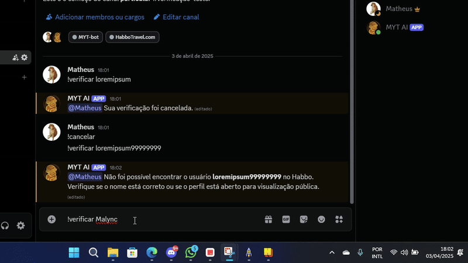

# Habbo Discord Verification Bot

HabboVerifyBot is a Discord verification bot that allows server administrators to verify if users are legitimate Habbo Hotel players. The bot works by generating a unique verification code that users must set as their Habbo motto. Once verified, users receive a special role in the Discord server.



### Key Features:
- Secure verification process using unique codes
- Automatic role assignment for verified users
- Customizable verification messages
- User-friendly commands for verification management
- Visual confirmation with custom generated images
- Multi-language support through customizable messages
This bot helps Habbo community Discord servers maintain authenticity by ensuring members are actual Habbo players, reducing the risk of spam accounts and enhancing community trust.

## Requirements

- Python 3.8 or higher
- Python libraries (installable via pip):
  - discord.py
  - requests
  - Pillow
  - python-dotenv

## Installation

1. Clone or download this repository
2. Install the required dependencies:

```bash
pip install discord.py requests Pillow python-dotenv
```

3. Create a `.env` file in the project root folder and add your Discord token:

```
DISCORD_TOKEN=your_token_here
```
4. Customize other settings as needed (prefix, role name, etc.)

## Usage

1. Run the bot:

```bash
python bot.py
```

2. In Discord, use the command `!verify USERNAME` replacing USERNAME with your Habbo username
3. Follow the instructions provided by the bot to complete the verification

## Customization

You can customize various settings in the `config.py` file:

- `PREFIX` - Command prefix (default: `!`)
- `VERIFY_COMMAND` - Verification command name (default: `verify`)
- `CODE_PREFIX` - Verification code prefix (default: `MYT-`)
- `EXPIRATION_TIME` - Expiration time in seconds (default: 5 minutes)
- `VERIFICATION_INTERVAL` - Interval between verifications in seconds (default: 5 seconds)
- `VERIFIED_ROLE` - Role name to be assigned (default: `Verified`)
- `SERVER_OPTION` - Habbo server to use (exemple: `habbo.com` / `habbo.com.br` / `habbo.es` / `habbo.de`)
- `BACKGROUND_IMAGE` - Path to custom background image 500x200px (default: `background.png`)
- `CUSTOM_FONT` - Path to custom TTF font file. If not found, will use system fonts.
- `FONT_SIZE` - Font size (default: `24`)
- `MAIN_TEXT_COLOR` - Main text color in RGB (default: `(255, 255, 255)`)
- `SECONDARY_TEXT_COLOR` - Secondary text color in RGB (default: `(255, 181, 77)`)

## Customizing Messages

All bot messages can be easily customized by editing the `messages.json` file. This allows you to change all text outputs without modifying the main code. The file is organized by command sections:

- `bot` - Messages related to bot startup
- `verify` - Messages for the verification command
- `verification_process` - Messages during the verification process
- `cancel` - Messages for the cancel command
- `restart` - Messages for the restart command

Each message can include placeholders like `{mention}`, `{habbo_user}`, etc. that will be automatically replaced with the appropriate values.
